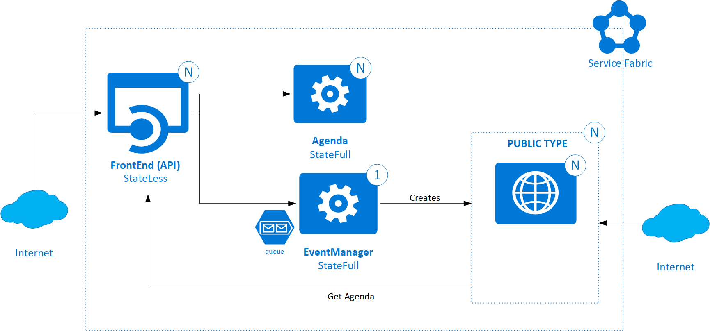

# Service Fabric, On-Demand Applications Demo
This simple project is a demo for a Service Fabric solution that dynamically creates Service Fabric applications on-demand.
The idea is to demonstrate how to create a new Service Fabric application upon a client request.

I have chosen to create a simple Asp.Net core website for events management as "target" application. A client, via a simple API, can request the creation of a website that will be dynamically created:



Each website will be reachable via the Reverse Proxy, like:

    http://localhost:19085/Events/EVENTID/FrontEnd/

The solution is composed by:

* **FrontEnd** (Stateless): AspNet Core Web Api, gateway for all the client calls
* **EventManager** (statefull): this service creates the new service fabric application. Use a queue to decouple the request from the creation (that takes time)
* **AgendaManager** (statefull): keeps the agendas in a replicated dictionary
* **Public Frontend** (stateless): is the website that is created dynamically. This uses the other services to display the agenda 

In this demo you can find some Service Fabric topics:
- How to dynamically create SF application
- How to dynamically pass manifest parameters
- Placement Constraints
- Service Fabric Reverse Proxy discovery (by 
[SFHelper](https://github.com/gianlucb/SFHelper))
- Scripts to build and deploy
- How to integrate Service Fabric with AspNet Core project
- How to set environment variables for services

## Build and Deploy

- .\Build.ps1
- .\DeployLocal.ps1

## Run
You can use the swagger UI at http://localhost/swagger to manually invoke the APIs or use the *TestClient* project in the *src\Extra* folder

**Note*: The public frontend website is forced to be deployed in a specific node type. If you want to test it online you need to change the Placement Constraints of the **Como.Public.Event.Frontend** type to an existing node type:*

```xml
   <PlacementConstraints>
      NodeType == NodeType2
   </PlacementConstraints>
```
and do the same change in the event manager code
